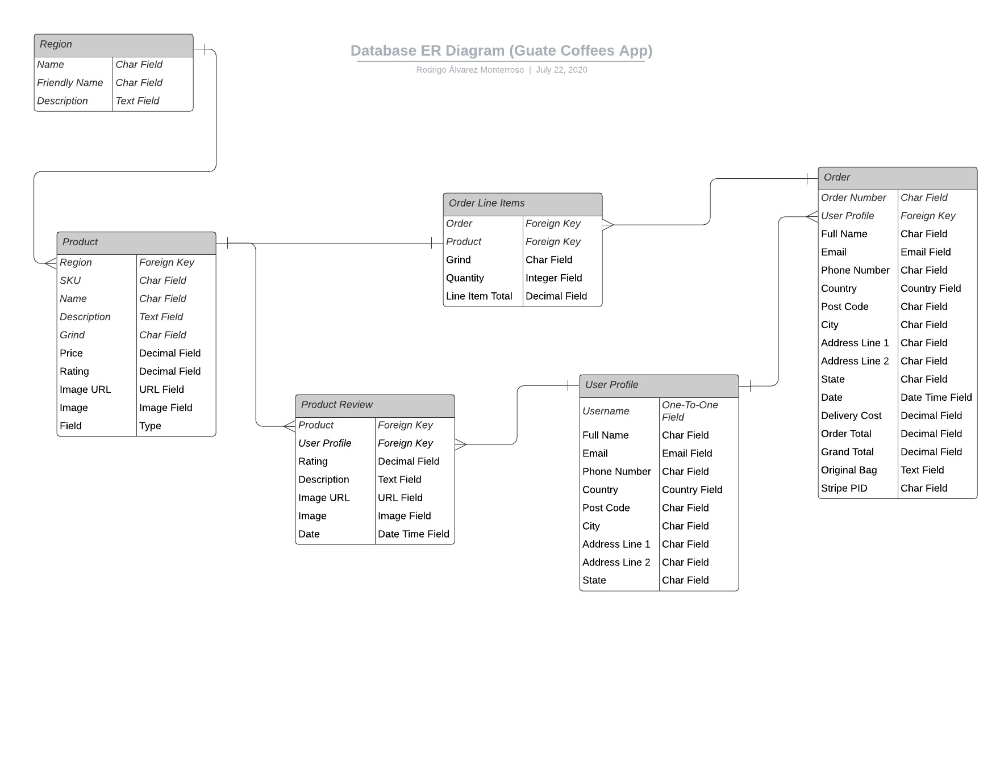

# Guatemalan Coffees shop

Welcome!

The development of this web application was carried out as my Fourth Milestone Project for the Full-Stack Web Development Diploma from the Code Institute.  

This appliction's code was written on my own using the Django Full-Stack Framework, Python, HTML5, CSS3 and JavaScript to demonstrate my personal skills and acquired knowledge from this online program. Some other libraries which are listed later on were used as well to simplify functions and styling. 

The application is deployed and available in Heroku and can be accessed here:

[Guatemalan Coffees Shop](https://guatemalan-coffees-shop.herokuapp.com/)

Feel free to use it and reach out for any comments or suggestions that you may have. 

**Important!** The Stripe test API is activated for this deployed app. Thus you can use the credit card number 4242-4242-4242-4242 with any expiry date in the future and any CCV to check out and cretae a fictional order. 

Mandatory Requirements:

 1. Django Full Stack Project: Build a Django project backend by a relational database to create a website that allows users to store and manipulate data records about a particular domain.
 2. Multiple Apps: The project must be a brand new Django project, composed of multiple apps (an app for each potentially reusable component in your project).
 3. Data Modeling: Put some effort into designing a relational database schema well-suited for your domain. Make sure to put some thought into the relationships between entities. Create at least 2 custom django models beyond the examples shown on the course
 4. User Authentication: The project should include an authentication mechanism, allowing a user to register and log in, and there should be a good reason as to why the users would need to do so. e.g., a user would have to register to persist their shopping cart between sessions (otherwise it would be lost).
 5. User Interaction: Include at least one form with validation that will allow users to create and edit models in the backend (in addition to the authentication mechanism).
 6. Use of Stripe: At least one of your Django apps should contain some e-commerce functionality using Stripe. This may be a shopping cart checkout, subscription-based payments or single payments, donations, etc. After paying successfully, the user would then gain access to additional functionality/content on the site. Note that for this project you should use Stripe's test functionality, rather than actual live payments.
 7. Structure and Navigation: Incorporate a main navigation menu and structured layout (you might want to use Bootstrap to accomplish this).
 8. Use of JavaScript: The frontend should contain some JavaScript logic you have written to enhance the user experience.
 9. Documentation: Write a README.md file for your project that explains what the project does and the value that it provides to its users.
 10. Version Control: Use Git & GitHub for version control.
 11. Attribution: Maintain clear separation between code written by you and code from external sources (e.g. libraries or tutorials). Attribute any code from external sources to its source via comments above the code and (for larger dependencies) in the README.
 12. Deployment: Deploy the final version of your code to a hosting platform such as Heroku.
 13. Security: Make sure to not include any passwords or secret keys in the project repository. Make sure to turn off the Django DEBUG mode, which could expose secrets.

## Wireframe 

## Database ER Diagram

